# Ouline - Where content finds structure (work in progress)

A modern Ghost CMS theme for blogs, tutorials, documentation, and knowledge-driven publishing.

## Features

- Vite-powered development and build pipeline for quick reloads and optimized bundles
- Tailwind CSS 4 with the Typography plugin for efficient styling
- Ready-to-ship structure with assets and basic pagination/navigation components
- Automatic image optimization using `Sharp` for better performance
- Theme packaging that exports a ZIP file for easy distribution and deployment

## Prerequisites

- Node.js 22+ and `pnpm` installed globally
- A local or remote Ghost instance (v6+) to test the theme

## Quick Start

1. Clone the repository:

   ```bash
   git clone https://github.com/frontendweb3/ghost-theme-starter-kit.git
   cd ghost-theme-starter
   ```

2. Install dependencies:

   ```bash
   pnpm install
   ```

3. Develop (build in watch mode):

   ```bash
   pnpm dev
   ```

   This runs `vite build --watch` so assets rebuild on change.

4. Production build:

   ```bash
   pnpm build
   ```

<details>
<summary><strong>Screenshots</strong> (click to expand)</summary>

Preview the theme across pages and devices. All screenshots are generated via `pnpm capture`.

| Page | Desktop (1440px) | Tablet (768px) | Mobile (390px) |
|---|---|---|---|
| Home | 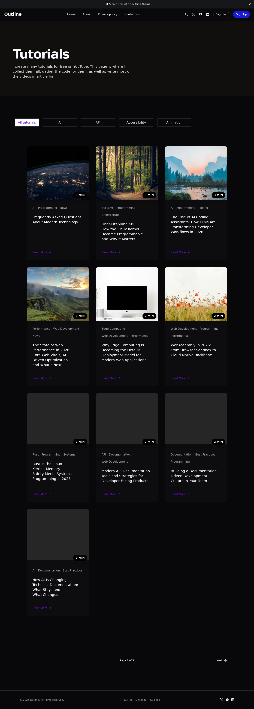 | 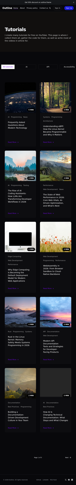 | 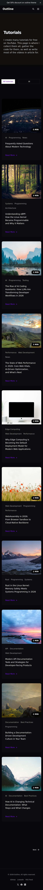 |
| About | 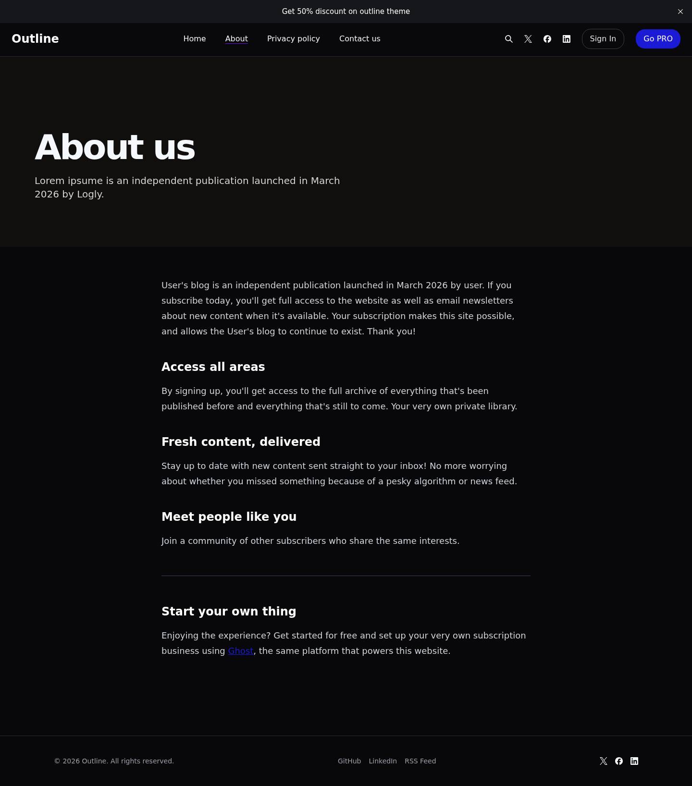 | 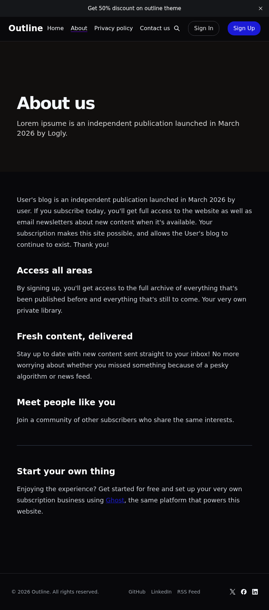 | 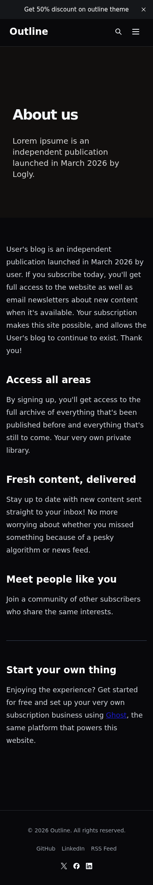 |
| Tag (AI) | 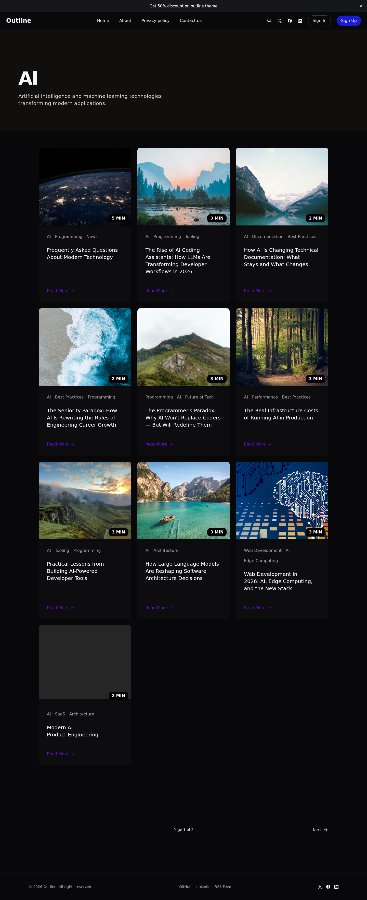 | 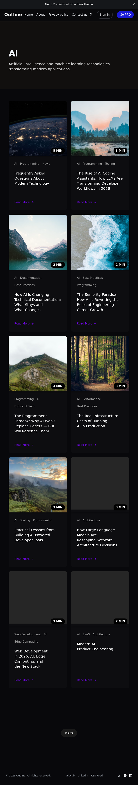 | 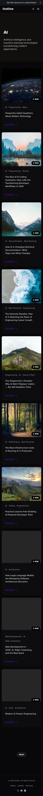 |
| Author | 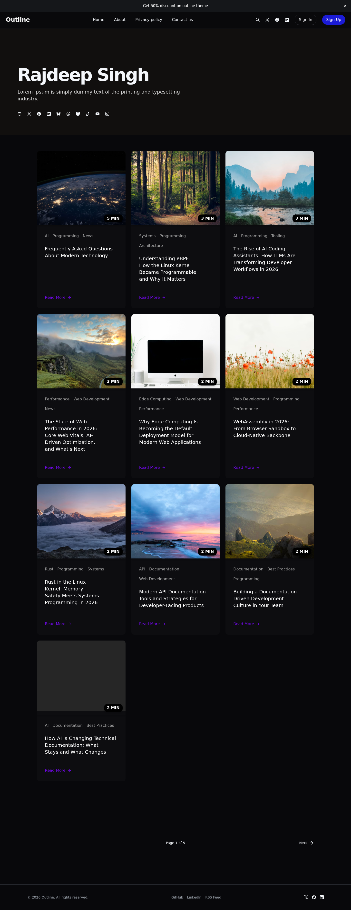 | 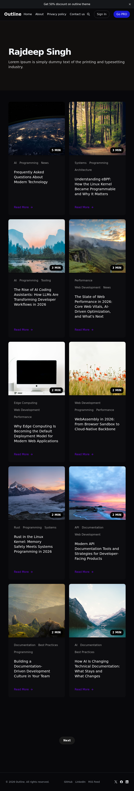 | 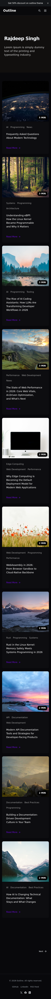 |
| Post | 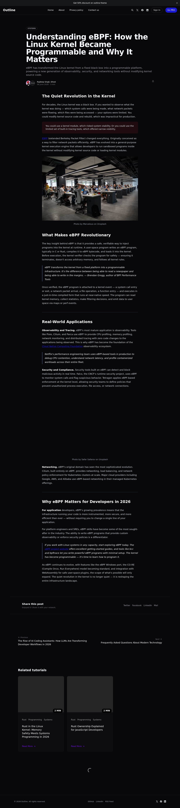 | 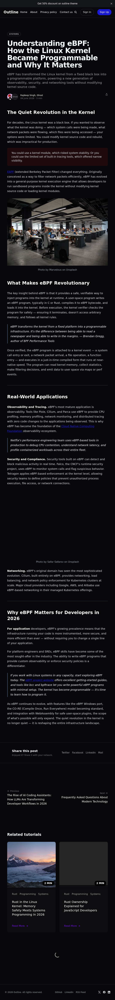 | 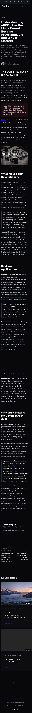 |

Browse the full gallery: [`screenshots/index.html`](https://refined-github-html-preview.kidonng.workers.dev/frontendweb3/Outline/raw/refs/heads/main/screenshots/index.html)

</details>

## Using with Ghost

- Copy the built theme output into your Ghost installation's `content/themes/<your-theme>/` directory (or symlink it during development).
- Restart Ghost so it picks up the new theme, then activate it in the Ghost admin UI.
- Adjust the `config` values in `package.json` (for example, `posts_per_page` and `card_assets`) to match your design needs.

## Custom Configuration

These settings are defined under `config.custom` in `package.json` and are editable from the Ghost admin panel under **Settings → Theme**.

| Setting | Type | Default | Description |
|---|---|---|---|
| `hero_title` | text | `Tutorials` | Custom title for the homepage hero section. Leave empty to use the site title. |
| `card_style` | select | `featured` | Post listing card style. `featured` — large featured card + grid, `simple` — uniform card grid. |
| `pagination_style` | select | `basic` | Pagination appearance. `basic` — nav with page numbers and icons, `simple` — Previous/Next buttons only. |
| `show_sign_in` | boolean | `true` | Show or hide the Sign In button in the site header. |
| `show_pro` | boolean | `true` | Show or hide the Go PRO button in the site header. |

## Project Structure

- Templates: `author.hbs`, `default.hbs`, `index.hbs`, `post.hbs`, `page.hbs`, `tag.hbs`, `error-404.hbs`
- Partials: `partials/` (header, footer, navigation, pagination, cards)
- Components: `partials/components` (button and icon). These are reusable UI partials, and the icon partial is built with Lucide.
- Assets: `assets/` (CSS, JS, images) compiled by Vite into `public/`
- Build config: `vite.config.ts`
- Images: source under `assets/images/` and optimized into `assets/dist/image/`

## Styling

- Tailwind CSS 4 is included via `tailwindcss` and `@tailwindcss/typography`.
- Add utility classes in `assets/css/styles.css` and extend via Tailwind config if desired.

## Lucide Icon Guide

This starter uses `lucide` with a reusable Handlebars partial.

1. Add the icon import in `assets/js/icons.js`.

   ```js
   import { createIcons, Sun, Moon, Search, UserRound, SendHorizontal, Heart } from 'lucide';
   ```

2. Register it in the `icons` object inside `createIcons`.

   ```js
   createIcons({
     icons: {
       Sun,
       Moon,
       Search,
       UserRound,
       SendHorizontal,
       Heart
     }
   });
   ```

3. Use the icon partial in any `.hbs` file.

   ```hbs
   {{> "components/icon" name="heart" class="w-4 h-4" ariaLabel="Heart icon"}}
   ```

Simple rule: import the icon as `Heart` in JavaScript, then use `name="heart"` in Handlebars. For two-word icons such as `UserRound`, use kebab-case in templates (`name="user-round"`).

## Shadcn UI CSS Variable Support

This starter supports shadcn-style design tokens (CSS variables), even though it is a Ghost theme and not a React app.

- Variables are defined in `assets/css/shadcn-variables.css`.
- The variables file is imported in `assets/css/styles.css`.
- Includes `:root` variables for light mode.
- Includes `.dark` variables for dark mode.
- Includes `@theme inline` mappings for Tailwind CSS 4 tokens.

In simple terms: these variables define your theme colors, spacing, radius, and shadows. Tailwind utility classes read from them, so you can update the theme from one place.

## Add/Change Fonts

You can choose font pairings from [Fonttrio](https://www.fonttrio.xyz/) and apply them in this theme.

Simple steps:

1. Choose a font pair and install it with a package manager or include it with a CDN.
2. Update font tokens in `assets/css/shadcn-variables.css`:
   - `--font-heading`
   - `--font-body`
3. Restart your local development server with `pnpm dev`.

In simple terms: change the font variables once, and heading/body typography updates everywhere.

## Add/Change Theme

This starter uses shadcn theme variables, so you can easily customize the theme.

1. Open a shadcn theme generator such as <https://shadcnstudio.com/theme-generator> or <https://tweakcn.com>.
2. Generate your preferred theme.
3. Copy the generated Tailwind/CSS variable output and paste it into `assets/css/shadcn-variables.css`.

In simple terms: generate a theme, replace the variables file, and rebuild the project.

## Vite Plugin List (Simple)

The following plugins are configured in `vite.config.ts`:

- `@tailwindcss/vite`
  - Why: compiles Tailwind CSS 4 during build/watch.
- `vite-plugin-image-optimizer`
  - Why: optimizes image assets (jpg/png/webp/svg/avif) for better performance.
- `vite-plugin-zip-pack` (production only)
  - Why: creates a final theme `.zip` file for Ghost upload/deployment.

## Scripts

- `pnpm dev` — Build in watch mode for development
- `pnpm build` — Creates a production build and generates the theme ZIP file.
- `pnpm capture` — Captures full-page screenshots of all configured routes across desktop, tablet, and mobile viewports using Playwright
- `pnpm test` — Tests the Ghost CMS v6 theme using the `gscan` CLI
- `pnpm clean` — Removes the `assets/dist` build output

## Licensing

This starter is released under the MIT License (see LICENSE.md). You are free to use it for personal, client, or commercial projects and to sell derived themes.
